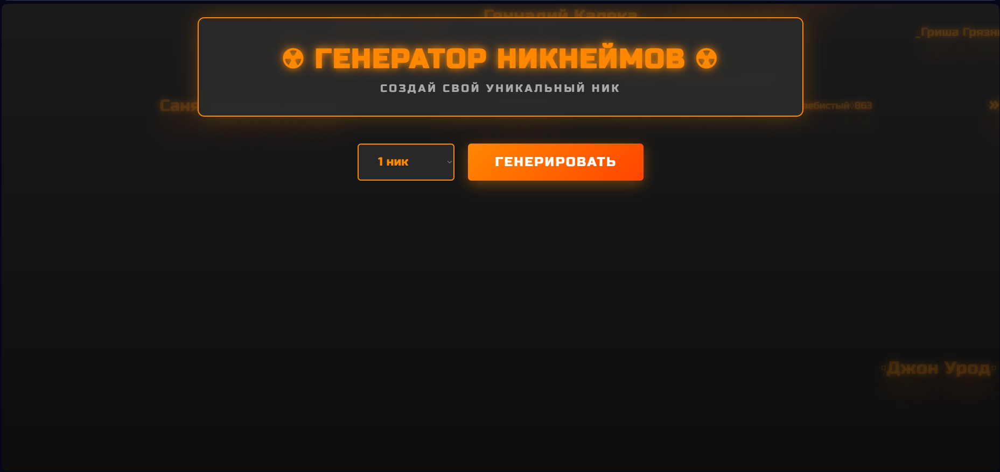
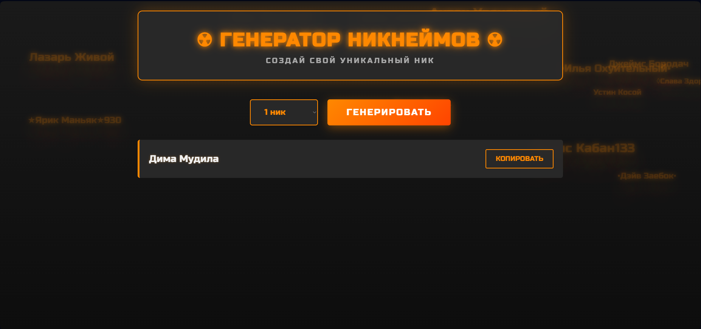
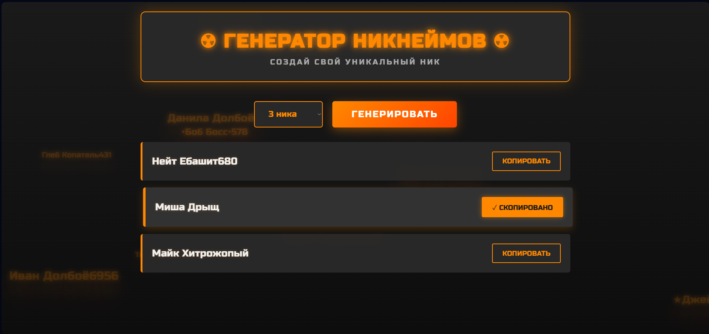

# Indust4
# Генератор Никнеймов

Веб-приложение на React для создания уникальных игровых никнеймов. Сделанное в рамках конрольной работы №4.

## Функционал

- Генерация от 1 до 20 никнеймов за раз
- 100 имён (75 русских + 25 английских) и 100 приставок
- Копирование в буфер обмена одним кликом
- Спецсимволы с обеих сторон (30% шанс):
- Случайные цифры в конце (30% шанс)
  

## Технологии

- React 18
- Vite
- CSS3 Animations
- Clipboard API

## Установка
git clone https://github.com/ваш-username/nickname-generator.git
cd nickname-generator
npm install
npm run dev

Приложение откроется на `http://localhost:5173`

## Структура проекта

nickname-generator/
├── src/
│ ├── App.jsx # Основной компонент
│ ├── App.css # Стили
│ └── main.jsx # Точка входа
├── package.json
└── README.md

## Скриншоты

### Копирование

## Автор

Squzmen — студент курса React

## Ссылка на GitHub

https://github.com/Squzmen/nickname-generator

